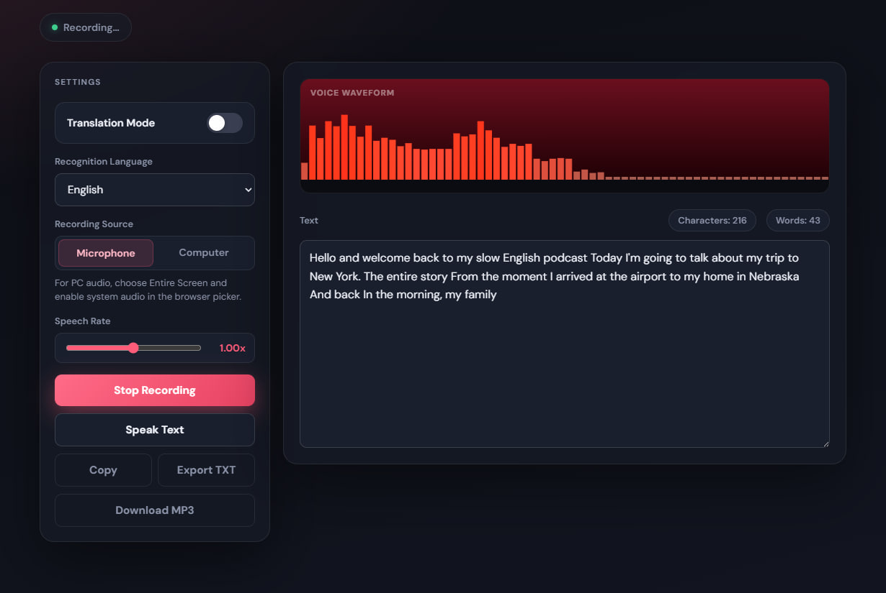
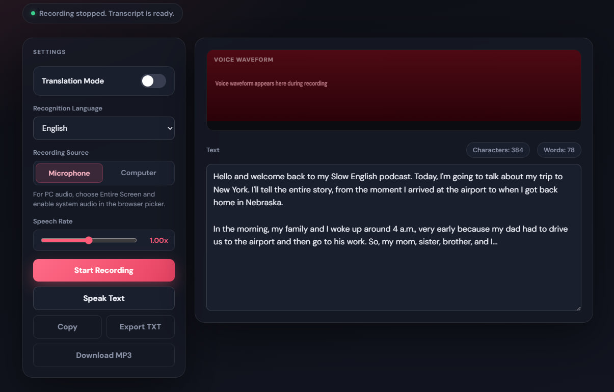
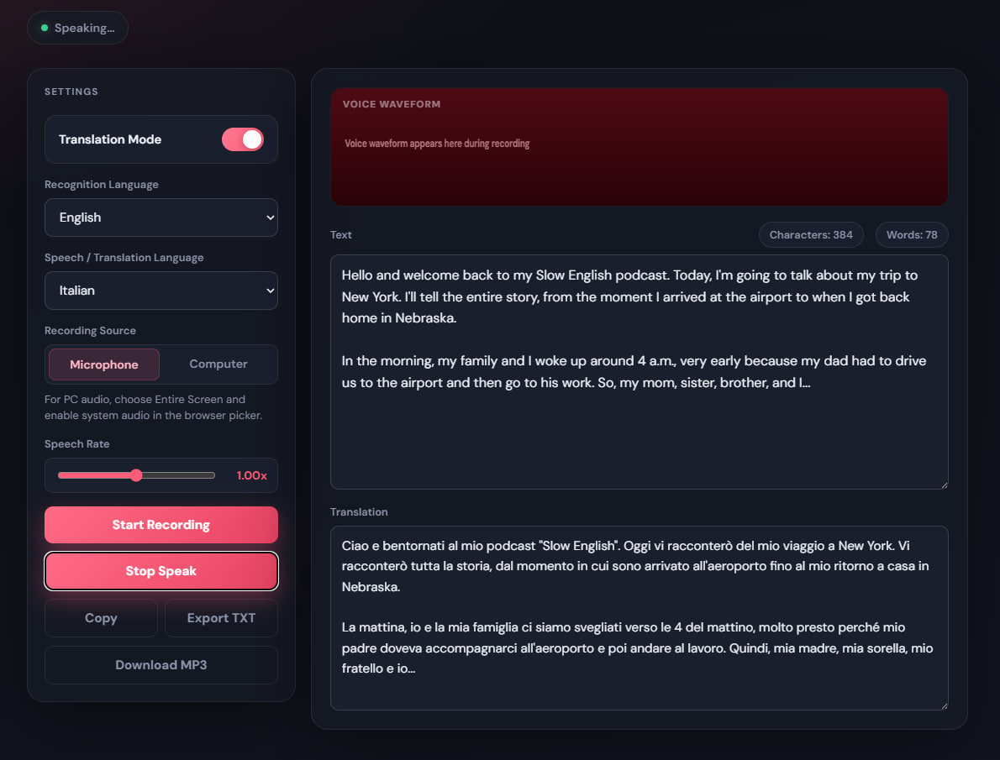

# 🎙️ Voice Studio Pro

Real-time speech transcription and translation powered by OpenAI and DeepL.

Speak naturally through your microphone, receive accurate transcripts, and instantly translate them into multiple languages while preserving proper names, brands, and product names.



---

## ✨ Features

- 🎤 Real-time microphone recording
- 📝 High-accuracy speech-to-text transcription
- 🌍 DeepL-powered translation
- ⚡ Fast backend processing
- 🔒 Secure server-side API handling
- 🏢 Preserves brand and product names
- 💻 Simple and intuitive UI

---

## 💾 Export Options

After processing your speech, you can export the results in multiple formats:

- 🎧 Download translated audio as **Download MP3**
- 📄 Download transcript as **Export TXT**

This makes it easy to reuse results for notes, documentation, content creation, or sharing.

---



---

### 🎧 MP3 Export

The translated text can be converted into speech and downloaded as an audio file.

Perfect for:
- listening on the go
- creating multilingual voice content
- accessibility use cases

---



---

### 📄 TXT Export

Download a clean text version of the transcription and translation.

Perfect for:
- documentation
- copying into reports
- saving conversation history

---

## 🛠️ Tech Stack

- Node.js
- Express.js
- OpenAI API (Speech-to-Text)
- DeepL API
- HTML / CSS / JavaScript

---

## 🚀 Installation

```bash
git clone https://github.com/vintoxa/voice-studio-pro.git
cd voice-studio-pro
npm install
```

---

## ⚙️ Configuration

Create or edit `config.js`:

```js
openaiApiKey = "YOUR_OPENAI_API_KEY";
deeplApiKey = "YOUR_DEEPL_API_KEY";
```

---

## ▶️ Run

```bash
npm start
```

Then open:

```
http://localhost:3000
```

---

## 🔄 How It Works

1. 🎙️ Speak into microphone or record audio
2. 📡 Audio sent to backend
3. 📝 OpenAI generates transcript
4. 🌍 DeepL translates text
5. 🎧 Optional: generate MP3 from translated text
6. 📄 Optional: export TXT file
7. ⚡ Result displayed instantly

---

## 💡 Example

Input:
```
Welcome to Google Cloud and Microsoft Azure.
```

Output (PL):
```
Witamy w Google Cloud i Microsoft Azure.
```

---

## 📈 Roadmap

- Translation history
- Multiple languages UI
- Audio export
- User accounts
- File upload support (optional)

---

## 👨‍💻 Author

Maksym Vintoniak
https://github.com/vintoxa

---

## ⭐ Support

If you like this project, give it a ⭐ on GitHub